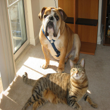

# Guided GradCAM in TensorFlow 

Implementation of Guided GradCAM [1] in TensorFlow 1.13.

Several techniques have been developed for understanding the decisions of a Convolutional Neural Network. GradCAM helps vizualing which parts of an input image trigger the predicted class, by backpropagating the gradients to the last convolutional layer, producing a coarse heatmap. 

Guided GradCAM is obtained by fusing GradCAM with Guided Backpropagation via element-wise multiplication, and results in a heatmap highliting much finer details. Please refer to the original paper [1] for further details. 

This technique is only useful for inspecting an already trained network, not for training it, as the backpropagation on ReLU will be changed for computing the Guided Backpropagation. 

Example code is provided in inference.py. A TF-Slim implementation of MobileNet V1 is used for the classification and visualization of gradients. 


<div id="panda-table">
    <table align="center">
	    <tr>
            <td style="padding:5px">
        	    <a href="url"></a>
      	    </td>
            <td style="padding:5px">
        	    <a href="url"></a>
      	    </td>
    	    <td style="padding:5px">
        	    <a href="url"></a>
      	    </td>
            <td style="padding:5px">
            	<a href="url"></a>
             </td>
        </tr>
        <tr>
            <td align="center" style="border-top: none";>Predicted: Panda</td>
            <td align="center" style="border-top: none";>GradCAM</td>
            <td align="center" style="border-top: none";>Guided Backprop</td>
            <td align="center" style="border-top: none";>Guided GradCAM</td>
        </tr>
    </table>
</div>

## Steps to Compute Guided GradCAM
**Step 1**

In order to compute the guided backpropagation gradient w.r.t. to the input image, we need to replace each ReLU activation with a guided ReLU [2]. This corresponds to setting all the
negative gradients to 0 during backpropagation.
The intuitive explanation is we are only interested in what image features the filters are detecting, not in what isn't being detected.


To achieve a guided ReLU, we can modify how the gradient is computed in a ReLU with: 

```python
@ops.RegisterGradient("GuidedRelu")
def _GuidedReluGrad(op, grad):
    return tf.where(0. < grad, gen_nn_ops.relu_grad(grad, op.outputs[0]), tf.zeros_like(grad))
```


The TF-Slim implementation of MobileNet v1 used in the example uses ReLU6 instead of ReLU. This corresponds to a bounded ReLU as explained in [2]. To replace every ReLU6 with our custom guided ReLU we need to call gradient_override_map on the graph we defined:

```python
graph = tf.Graph()
with graph.as_default():
    with graph.gradient_override_map({'Relu6': 'GuidedRelu'}):
```

**Step 2**

Compute the gradient of the score for target class (before the softmax activation!) w.r.t. to each of the activation maps of the last convolutional layer.

For using the score of the predicted class for the gradient computation, we need to first add an op to the graph that returns the value of the highest logit. Remember, I am not running TF with Eager Execution and for computing the gradients we need the tf.gradients op to be added to the graph before calling TF.session. As a result, an op that returns the value of the highest logit also needs to be added to the graph:

```python
max_logit = tf.reduce_max(logits, axis=1)
```

The gradients wrt to each of the activation maps of the  can now be computed with:

```python
conv_gradient = tf.gradients(max_logit, conv_activations)[0]
```

If the goal is to compute the Guided GradCAM for a specified class, then we can skip the tf.reduce_max op and compute the gradients w.r.t. to the logit of the specified class.

```python
conv_gradient = tf.gradients(logits[:, FLAGS.label], conv_activations)[0]
```

**Step 3**

In order to determine the Guided Backpropagation gradient, we then need to add an op to compute the gradient of the logit wrt to the input image

```python
guided_backprop = tf.gradients(max_logit, processed_images)[0]
```

**Step 4**

After evaluating the value of the activation maps of the last convolutional layer and the defined tf.gradient ops inside a tf.Session, call the function provided in gradcam.py:

```python
gradcam(conv_activations, conv_gradients, guided_backpropagation)
```


## Running the example
Download TF-Slim models from https://github.com/tensorflow/models/tree/master/research/slim and the ImageNet checkpoint file from http://download.tensorflow.org/models/mobilenet_v1_2018_02_22/mobilenet_v1_1.0_224.tgz .


```bash
python inference.py --image=cat.jpg --label=282
```
If no label parameter is passed, the predicted label is used instead for computing the CAM and Guided Backpropagation.

## Examples
<div id="car-table">
    <table align="center">
	    <tr>
            <td style="padding:5px">
        	    <a href="url"></a>
      	    </td>
            <td style="padding:5px">
        	    <a href="url"></a>
      	    </td>
    	    <td style="padding:5px">
        	    <a href="url"></a>
      	    </td>
            <td style="padding:5px">
            	<a href="url"></a>
             </td>
        </tr>
        <tr>
            <td align="center" style="border-top: none";>Predicted: Race Car</td>
            <td align="center" style="border-top: none";>GradCAM</td>
            <td align="center" style="border-top: none";>Guided Backprop</td>
            <td align="center" style="border-top: none";>Guided GradCAM</td>
        </tr>
    </table>
</div>

By specifying the target class, it is possible to see which areas of the image contribute to it vs the predicted class:

<div id="dog-table">
    <table align="center">
	    <tr>
            <td style="padding:5px">
        	    <a href="url"></a>
      	    </td>
            <td style="padding:5px">
        	    <a href="url"></a>
      	    </td>
    	    <td style="padding:5px">
        	    <a href="url"></a>
      	    </td>
            <td style="padding:5px">
            	<a href="url"></a>
             </td>
        </tr>
        <tr>
            <td align="center" style="border-top: none";>Predicted: Bulldog</td>
            <td align="center" style="border-top: none";>GradCAM</td>
            <td align="center" style="border-top: none";>Guided Backprop</td>
            <td align="center" style="border-top: none";>Guided GradCAM</td>
        </tr>
    </table>
</div>

<div id="cat-table">
    <table align="center">
	    <tr>
            <td style="padding:5px">
        	    <a href="url"></a>
      	    </td>
            <td style="padding:5px">
        	    <a href="url"></a>
      	    </td>
    	    <td style="padding:5px">
        	    <a href="url"></a>
      	    </td>
            <td style="padding:5px">
            	<a href="url"></a>
             </td>
        </tr>
        <tr>
            <td align="center" style="border-top: none";>Target: Tabby cat</td>
            <td align="center" style="border-top: none";>GradCAM</td>
            <td align="center" style="border-top: none";>Guided Backprop</td>
            <td align="center" style="border-top: none";>Guided GradCAM</td>
        </tr>
    </table>
</div>

## Acknowledgements
The following repositories and pages proved useful for my understanding and implementation of Guided Gradcam:

https://github.com/cydonia999/Grad-CAM-in-TensorFlow

https://github.com/Lasagne/Recipes/blob/master/examples/Saliency%20Maps%20and%20Guided%20Backpropagation.ipynb

https://mxnet.incubator.apache.org/versions/master/tutorials/vision/cnn_visualization.html


## References
[1] Selvaraju, Ramprasaath R., et al. "Grad-cam: Visual explanations from deep networks via gradient-based localization." Proceedings of the IEEE International Conference on Computer Vision. 2017.

[2] J.  T.  Springenberg,  A.  Dosovitskiy,  T.  Brox,  and  M.  A.  Ried-miller.  Striving for Simplicity:  The All Convolutional Net.CoRR,abs/1412.6806, 2014

[3] https://stackoverflow.com/questions/47220595/why-the-6-in-relu6/47220765